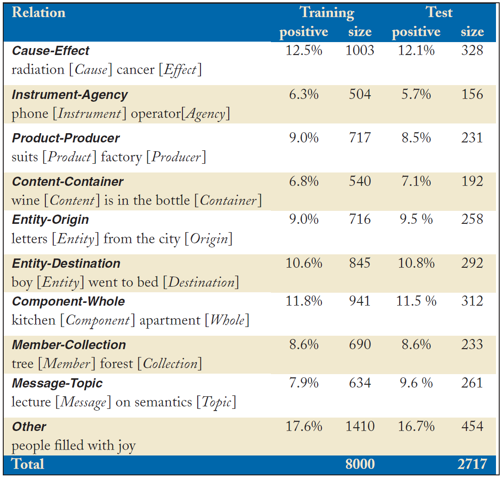

# relation-extraction-dataset
The repo covers some widely used relation extraction datasets and will be continuously updated.

## SemEval2010 Task8 dataset

This dataset is a freely available dataset by Hendrickx et al. (2009) which contains 10,717 samples which are divided as 8,000 for training and 2,717 for testing.

The details of relations are as follows:

More details can access:
* [SemEval2010 Task8 official document](https://docs.google.com/document/d/1QO_CnmvNRnYwNWu1-QCAeR5ToQYkXUqFeAJbdEhsq7w/preview)
* [中文版本--关系抽取：SemEval2010 Task8数据集](https://blog.csdn.net/qq_29883591/article/details/88567561)

## NYT dataset

* **NYT10** is originally released by the paper "Modeling relations and their mentions without labeled text."[[paper]](https://link.springer.com/content/pdf/10.1007/978-3-642-15939-8_10.pdf)
  * [[dataset download]](http://iesl.cs.umass.edu/riedel/ecml/) 
* **NYT11** is provided by the paper "Knowledge-Based Weak Supervision for Information Extraction of Overlapping Relations"[[paper]](https://www.aclweb.org/anthology/P11-1055.pdf)[[code]](http://raphaelhoffmann.com/mr/)
  * [[dataset download]](https://drive.google.com/drive/folders/0B--ZKWD8ahE4UktManVsY1REOUk)

Here are some papers that use this dataset and open source code:

* "CoType: Joint Extraction of Typed Entities and Relations with Knowledge Bases"[[paper]](https://arxiv.org/pdf/1610.08763.pdf)[[code]](https://github.com/INK-USC/USC-DS-RelationExtraction)
* "Joint Relation Extraction with Hierarchical Reinforcement Learning"[[paper]](https://arxiv.org/abs/1811.03925)[[code]](https://github.com/truthless11/HRL-RE)

## FewRel dataset

**Introduction:**
* FewRel is built with Wikipedia as the corpus and Wikidata as the knowledge graph by Tsinghua University's Natural Language Processing Lab.
* This dataset contains 100 categories and 70,000 instances, fully surpassing the previous similarly labeled data sets.
* In the dataset, the average length of each sentence is 24.99, and a total of 124,577 different words or symbols appear.

**download**: [[dataset]](https://thunlp.github.io/fewrel.html)

More details can also access:[https://thunlp.github.io/fewrel.html](https://thunlp.github.io/fewrel.html)
